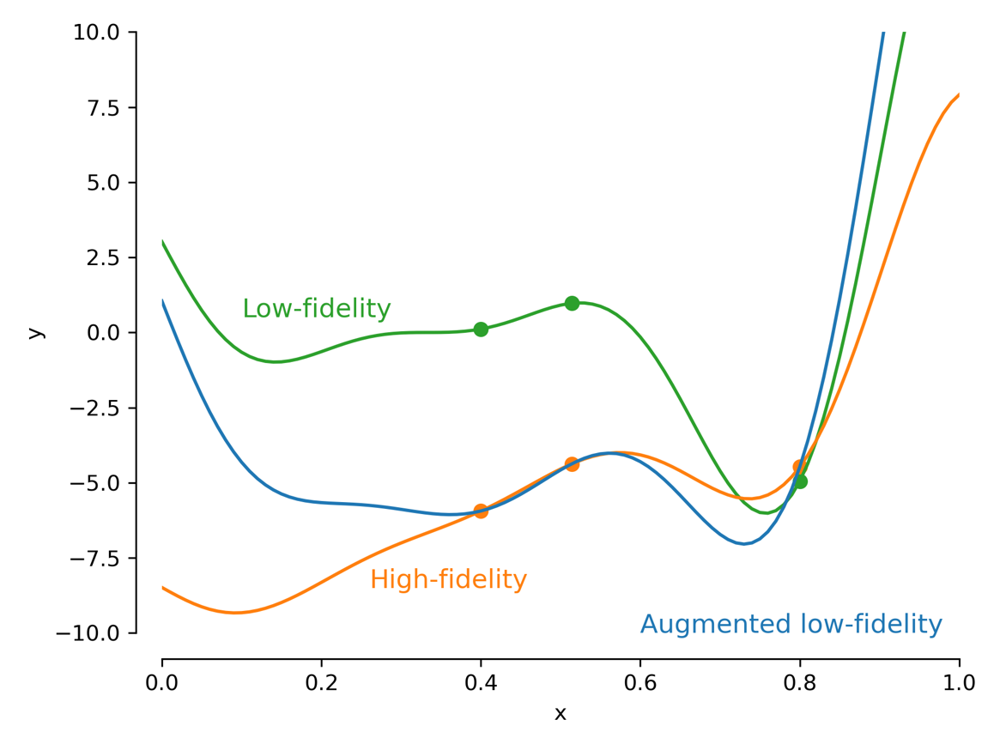

## Contributions to WEIS

As part of the [ARPA-E Atlantis program](https://arpa-e.energy.gov/?q=arpa-e-programs/atlantis), NREL is developing [WEIS, the Wind Energy with Integrated Servo-control toolset](https://www.nrel.gov/news/program/2019/best-of-both-worlds.html).
For this project, I serve as an optimization methods and implementation expert as we adapt tools to be better suited for efficient design optimization.
Expanding the toolset's capabilities include developing efficient derivative computation methods to enable gradient-based optimization, adding new optimization methods to the stack, and examining the best optimization problem architectures.

### Implementing multifidelity optimization methods

Multifidelity methods combine information from low-cost low-fidelity methods with high-accuracy high-fidelity methods to find optimal designs with reduced computational expense.
One of the main research thrusts of WEIS is to implement multifidelity methods and use them to optimize complex floating offshore wind turbine systems.
Although NREL has some experience with multifidelity methods for layout optimization, turbine design has not yet been explored.

My work focuses on implementing existing multifidelity methods from the literature for use in turbine design problems.
Specifically, one goal of WEIS is to use information from WISDEM and OpenFAST together to obtain optimal turbine designs.

To begin, I surveyed the literature and identified a sensible first multifidelity method: the trust-region method.
I implemented this method with a general API in Python and tested its viability using simple functions.
The figure below shows how the low- and high-fidelity models are combined into a multifidelity model for a simple one-dimensional test problem.

  

I then demonstrated the trust-region approach by maximizing the Cp of a turbine blade using CCBlade and AeroDyn as the low- and high-fidelity models respectively.
Here, I allowed the optimizer to vary the chord using two control points with no constraints.
We found that the trust-region approach uses **20% less computational time and 80% fewer calls** to the high-fidelity method compared to optimizing using only the high-fidelity method.
This suggested that multifidelity methods are worth developing further.
The table below has more comparison numbers from this study.

  

Efforts from this work and more will be included in a journal paper that I will write once we evaluate more complex constrained optimization problems. 

### Introducing new optimization drivers to WEIS and OpenMDAO

Another task within WEIS is to introduce additional optimization libraries into the toolset.
After examining the available packages, including NLopt, DAKOTA, chaospy, pyomo, COIN-OR, DEAP, cvxpy, and uncertainties, we determined that NLopt and DAKOTA were worth adding to the toolset.

I implemented an [OpenMDAO driver for NLopt](https://github.com/WISDEM/WEIS/blob/master/weis/optimization_drivers/nlopt_driver.py) which works using the same API as the native drivers in OpenMDAO.
It is fully tested and verified for multiple types of constrained nonlinear optimization problems.

### WISDEM documentation and code quality improvement

- Contributed to many bugfixes and code cleanup commits
- Introduced Coveralls to show where we need to improve testing
- Added docs throughout, link to them here

## IEA Task 37 layout optimization

This is a continuation of the work [I originally presented here](https://github.com/johnjasa/nrel_work_portfolio/tree/master/2020_04-05#iea-task-37-layout-optimization).

Since then, we have refined the presentation of our results and written our sections in the joint paper.
Our ongoing work is to examine an extension of this work into a more general set of findings for a paper comparing different layout optimization techniques.
These methods will be implemented and documented in FLORIS in the coming months.