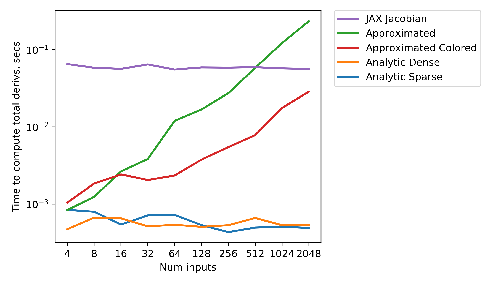

# John Jasa's NREL work portfolio

This portfolio serves to document and highlight my contributions to NREL projects, focusing on deliverables and tangible value-add.

It is a continual work-in-progress and is roughly divided by project.

## Contributions to WEIS

### Efficient derivative computation study

I set up and ran multiple computational experiments to benchmark different ways to compute derivatives for WISDEM, with the [results hosted here](https://github.com/johnjasa/derivative_comparisons).

Large portions of [WISDEM](https://github.com/WISDEM/wisdem) lack efficient derivative calculations, which would speed up gradient-based optimization.
This comparison study aimed to benchmark derivative computation methods that are relevant to WISDEM to determine their feasibility and utility.

I found that depending on the size of the inputs and outputs to the component, as well as the underlying code complexity, automatic differentiation may be a reasonable solution.
Analytic derivatives were always the fastest in terms of computational time, but required much more developer time, so they should be implemented only for extreme bottlenecks within the codebase.

  

### Introducing new optimization drivers to WISDEM and OpenMDAO

One of the goals of the WEIS project is to enable efficient exploration of the complex design space for floating offshore turbines.
To do this, we plan on integrating additional optimization packages into WISDEM so we can use evolutionary algorithms, discrete design variables, and eventually uncertainty quantification.

Towards this goal, I have implemented [NLopt](https://nlopt.readthedocs.io/) as a driver in OpenMDAO so we can use it in WISDEM.
NLopt provides optimization methods we previously could not access, including ISRES and DIRECT, which are both global optimizers.
My [driver implementation is hosted here](https://github.com/johnjasa/OpenMDAO/blob/nlopt_driver/openmdao/drivers/nlopt_driver.py) and I've written [tests verifying its capabilities here](https://github.com/johnjasa/OpenMDAO/blob/nlopt_driver/openmdao/drivers/tests/test_nlopt_driver.py).

This task is ongoing and Rob Hammond and I are working together to get more advanced optimization packages integrated, including [DAKOTA](https://dakota.sandia.gov/).

### WISDEM documentation and code quality improvement

- Contributed to many bugfixes and code cleanup commits
- Set up automated doc generation with the results [hosted here](https://wisdem.readthedocs.io/en/latest/)
- [Created a script](https://github.com/WISDEM/WISDEM/blob/IEAontology4all/docs/_utils/convert_docstrings.py) to parse WISDEM components and automatically produce docstrings to increase user understanding of the code. These docstrings live in the actual component files and are also automatically rendered on the documentation site. For example, [here is the page for the Tower component in WISDEM](https://wisdem.readthedocs.io/en/latest/wisdem/towerse/documentation.html), showing the API documentation.

## BAR tower redesign

I optimized the tower used in BAR studies to meet design constraints and lower overall LCOE.

Because BAR was mostly focused on rotor and blade design, they were using a placeholder tower with linear taper and a 10 meter base diameter.
However, that original tower did not meet buckling and frequency constraints, and its 10 meter diameter prevented it from being easily transportable.
To both obtain a better tower design and help get me accustomed to useing WISDEM, I design and performed a series of studies with different design constraints to understand the design space and provide BAR with a more reasonable tower design.

## IEA Task 37 layout optimization

## Context
There are a few ways to efficiently compute derivatives:
- Analytic expressions, by hand
- Automatic differentiation (AD), by computer, either via source code transformation or operator overloading
- Parallel complex step with coloring, to decrease the total amount of calls to the derivative approximation method
It's unclear which method will be the fastest, both in terms of dev and computational time.

The [OpenMDAO](https://github.com/OpenMDAO/OpenMDAO/) and [FLORIS](https://github.com/NREL/floris) dev teams have previously looked into multiple AD options.
Here's a quick summary of what they found:
- [Tangent](https://github.com/google/tangent) : Source code transformation, so it produces human-readable Python for both the forward and reverse modes. However, it's missing quite a few numpy functions and most of the compute functions would need to be rewritten to be compatible; perhaps majorly rewritten.
- [JAX](https://github.com/google/jax) ([Autograd](https://github.com/HIPS/autograd)) : FLORIS team had good results with Autograd, though they had to carefully write their code to be compliant. They're currently adapting FLORIS to work with JAX. One concern with this method for WISDEM would be how much we'd need to rewrite existing `compute` functions.
- [Parallel CS with coloring](http://openmdao.org/twodocs/versions/3.0.0/features/experimental/simul_coloring_fd_cs.html) : This is natively built into OpenMDAO, currently as an experimental feature because not many outside users have provided input to the API. It'd take less `compute` function rewriting than the previous two methods. The computations would have to be complex-safe. Depending on the size of the inputs and outputs, this may be slower computationally than the first two methods.
- [Sympy](https://www.sympy.org/en/index.html) : Symbolically differentiate compute functions. This works for relatively simple computations without large vectors. It's generally more computationally expensive due to the symbolic math library and takes a good amount of rewriting the `compute` function. I wouldn't recommend this, as-is.

## Action plan
1. Create a simple representative system in OpenMDAO, maybe as simple as using the existing Sellar problem.
2. Vectorize this system so the size of the optimization problem can easily be scaled.
3. Create different versions of this system, with derivatives computed by hand, JAX, naive partials FD, naive totals FD, totals CS w/ coloring, and parallel CS w/ coloring to start.
4. Perform multiple optimizations using these different methods across a range of problem sizes.
5. Produce comparison visualizations for each of the different methods and write up a conclusions summary.
6. (stretch goal if warranted) Add Sympy and Tangent as two other methods to compare.

## Expected costs and outcomes
Approximately 12-16 work-hours to complete.

The naive FD/CS methods will be quick to implement and provide reasonable performance, with coloring greatly increasing speed.
JAX will require some work to format the function calls correctly, but will provide a good speedup.
Analytic by hand will be the fastest computationally, but challenging to generalize.
Approx_totals with coloring might be the fastest for some cases, depending on the scaling.

This study should inform the use of certain methods for WISDEM derivative development. A mix of methods will most likely be optimal.

# Problem setup and results

## Problem setup

To compare these derivative computation methods, we need a representative system implemented in OpenMDAO.
This system should be easily scalable so we can see how problem size affects computation cost.
Using an existing subsystem from WISDEM would be the most representative, but few of those are easily scalable and differentiable.

Instead, we use a straightforward system that consists of two components, shown schematically in the first image below.
The first component takes in a vector `x` and performs a simple analytic multiplication and summation to produce the vector `y`.
We can control the size of `x` and the size of `y` using `num_inputs` and `num_outputs`, respectively.
The second component in this system simply takes `y` and sums all values in the array to produce a scalar quantity, `obj`.
This mimics the subsystems in WISDEM that produce the objective quantity, whatever that is.

  

The Jacobian of the first component, the array of derivatives of the outputs with respect to the inputs, is shown in the figure below.
We can control the size, shape, and sparsity of the Jacobian by changing the values for `num_inputs`, `num_outputs`, and `bandwidth`.
`bandwidth` changes how many of the `x` values are used to produce one entry in the `y` array.
We can see how different derivative computation methods scale by changing the Jacobian sparsity.

  

Due to the simple nature of this system, this study only compares partial derivative computation methods.
Total derivative approximation is not studied here, but is used in WISDEM run cases, so that will be investigated in future work.
We compare five methods of partial derivative computation on the first component above.
In each approximation case, we are using real finite differencing, not complex step, as some of the methods in WISDEM are not complex-safe.

## Results

**In short, analytic methods are the fastest across the board, then approximation schemes, then JAX. Advanced features of JAX have not been implemented here due to the learning curve, but those could enhance AD performance.**

The figure below shows results for the five differentiation methods across six separate studies.
The top row shows the time required to compute the total derivatives of the system once, whereas the bottom row shows the total cost of a simple optimization problem using the system.
The first column varies the number of outputs from the first component, the second column varies the number of inputs/optimization design variables, and the final column varies the Jacobian bandwidth.
In each case, when one quantity is varied, the other two are held fixed.

All methods show a strong dependence on the number of outputs.
JAX scales well with the number of inputs, whereas the other methods' optimization costs increase.
Most methods are relatively insensitive to Jacobian bandwidth, and we see the approximated coloring method increase slightly as fewer colors can be used, leading to greater computational cost.

Based on these results, it seems there is significant overhead to the JAX computation, leading it to be uncompetitive for extremely low-cost functions.
With more expensive `compute()` functions, the cost trends for JAX would be different.

The trends for optimization cost are different than those for only total derivative computation for a few reasons; there's additional overhead in the optimization process, the number of degrees of freedom in design affect convergence, and depending on derivative accuracy the optimization may take more or fewer iterations.

Next, we'll highlight some of these plots individually and discuss their trends.

First, total derivative cost scaling with number of inputs.
Because we use the adjoint (reverse) method with the analytic derivatives, there is little-to-no increase in cost as we increase the number of inputs.
Both approximation schemes' cost increases with the number of inputs because they are inherently forward methods, but the colored approximation scales sublinearly by taking advantage of the sparsity pattern of the Jacobian.
JAX is able to use the reverse method which leads to a similar flat trend as the analytic methods, but it is inherently about two orders of magnitude more expensive.

All methods exhibit similar scaling as we increase the number of outputs, though JAX is generally 1-2 orders of magnitude more expensive.
As we increase the number of outputs, the number of inputs remains the same, so the coloring scheme is not faster than the normal approximation scheme.

Most methods are flat as we increase the bandwidth of the Jacobian, but the approximated colored method slightly increases as we need to use more colors to compute the Jacobian.

## Future work

This is a glimpse at how these derivative computation methods perform for a specific and simple problem.
These trends wouldn't necessarily hold for all functions or problems.
There are a few interesting avenues for future work, including:
- Use a `compute()` function from a WISDEM component for a more relevant comparison
- Set up a group with multiple components to compare total vs. partial derivative computation performance
- Implement more advanced features of JAX, including vectorization and sparsity, to drive its cost down
